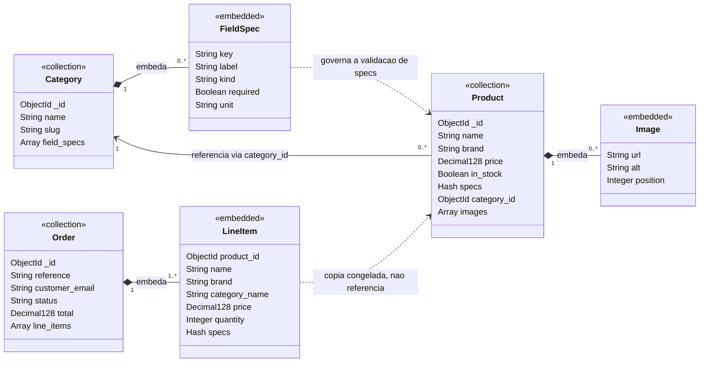
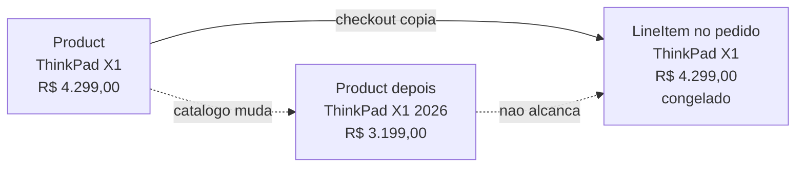
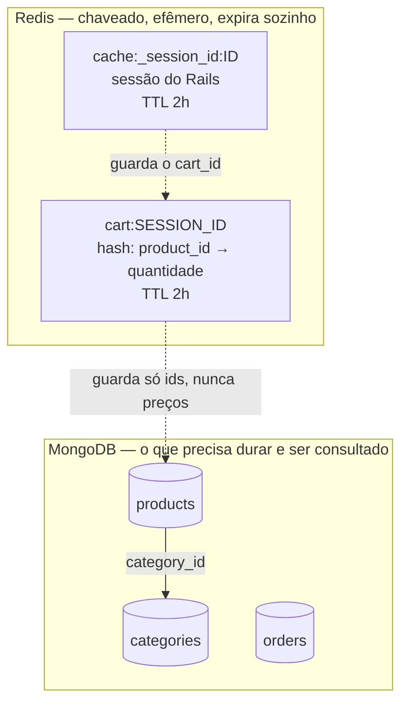

# Modelagem de dados

Documento de referência do projeto. Descreve o **modelo alvo** — nem tudo existe
ainda; a coluna de status diz o que já foi construído.

| Entidade | Onde vive | Checkpoint |
|---|---|---|
| `Category` + `FieldSpec` | MongoDB, coleção `categories` | 2 🔄 |
| `Product` + `Image` | MongoDB, coleção `products` | 3 ⬜ |
| Carrinho | Redis, `cart:<id>` | 8 ⬜ |
| `Order` + `LineItem` | MongoDB, coleção `orders` | 9 ⬜ |

---

## A regra que decide tudo

> **Embede o que é possuído, limitado e sempre lido junto com o pai.
> Referencie o que é compartilhado, ilimitado ou consultado por conta própria.**

Aplicada caso a caso:

| Relação | Decisão | Por quê |
|---|---|---|
| `Category` → `FieldSpec` | **embeda** | Um field spec não significa nada fora da categoria, nunca é consultado sozinho, e são poucos. Embedar faz ler a categoria *com o schema dela* custar uma única busca — e isso importa porque toda validação de produto lê esse schema. |
| `Product` → `Image` | **embeda** | Pertence a exatamente um produto, quantidade limitada, sempre exibida junto. Coleção separada só acrescentaria uma consulta por página. |
| `Product` → `Category` | **referencia** | Uma categoria é compartilhada por milhares de produtos, é mutável (renomear não pode reescrever todos os produtos) e é listada por conta própria. Embedar duplicaria dado mutável — a anomalia de atualização clássica. |
| `Order` → `LineItem` | **embeda** | Um pedido é lido como unidade e suas linhas não existem fora dele. |
| `LineItem` → `Product` | **copia** | Não é referência: é uma cópia congelada. Ver mais abaixo. |

---

## O modelo de documentos

Em UML, **composição** (losango cheio, `*--`) significa "parte de, com ciclo de
vida atrelado ao dono" — que é exatamente o que embedar é. **Associação** (seta,
`-->`) é referência.

Três coisas para ler no diagrama:

**`FieldSpec` e `Image` não têm `_id` de coleção.** Não são coleções. Existem
como sub-documentos dentro do array do pai. `db.getCollectionNames()` nunca vai
listar `field_specs` nem `images` — é assim que se prova que o embed funcionou.

**Só `Product → Category` é seta sólida.** É a única referência do modelo. O
produto guarda `category_id`; nada mais aponta para nada.

**As duas setas tracejadas não são associações de banco.** São relações
semânticas que o Mongoid não conhece:

- `FieldSpec ..> Product` é o coração do projeto: o `kind`, o `required` e o
  `key` declarados pela categoria são o que valida o hash `specs` do produto,
  em tempo de escrita (checkpoint 4).
- `LineItem ..> Product` é deliberadamente **não** uma referência. Ver abaixo.

---

## Por que o pedido copia em vez de referenciar

Um `Order` guarda uma cópia de nome, marca, preço e specs **como estavam no
momento da compra**.

Duplicação deliberada, e é a troca certa:

- **Um pedido é um fato histórico.** "Você pagou R$ 4.299,00 por um notebook com
  16 GB" tem que continuar verdadeiro depois que o preço cair, a spec for
  corrigida, o produto for renomeado ou apagado. Uma referência deixaria qualquer
  edição de catálogo reescrever o histórico — inclusive o valor cobrado.
- **A objeção usual não se aplica.** Denormalizar costuma ser rejeitado porque as
  cópias divergem. Aqui a cópia *deve* divergir: ela é imutável por definição,
  nunca é atualizada, então não existe anomalia de atualização.
- **A leitura é de um documento só.** Renderizar um pedido não precisa de
  `$lookup` nem de N+1, com quantas linhas for.

`product_id` fica guardado, mas só como procedência — nada o dereferencia para
renderizar o pedido, e um pedido cujo produto foi apagado continua completo.

---

## Os dois bancos

O carrinho está no Redis porque é **chaveado e nunca consultado** (um `HGETALL`
por sessão, sem índice e sem filtro), **de escrita intensa** (cada "+1" é um
`HINCRBY`, não a reescrita de um documento) e **expira sozinho** — `EXPIRE` é TTL
nativo. O equivalente no MongoDB seria um campo `abandonado_em`, um índice TTL e
um documento que fica lá até o varredor perceber.

E repare no que o Redis **não** guarda: nome nem preço de produto. Ele guarda
ids; os produtos vêm do MongoDB, que continua sendo a fonte única da verdade.
É por isso que uma mudança de preço aparece imediatamente num carrinho ainda não
finalizado — e por que ela *não* aparece num pedido já fechado.

---

## O que isso custaria num banco relacional

Vale ter a resposta pronta, porque é a pergunta óbvia numa arguição.

| Aqui | No PostgreSQL |
|---|---|
| `field_specs` embedado | tabela `field_specs` com FK + join em toda leitura de categoria |
| `specs` como hash livre por produto | ou uma tabela EAV (`product_id`, `key`, `value` como texto), ou uma coluna por spec de toda categoria que existir |
| categoria nova = um `insert` | tabela nova ou colunas novas = **migration** |
| índice wildcard em `specs.$**` | impossível: não dá para indexar colunas que ainda não existem |

A tabela EAV é a alternativa honesta, e ela perde tipagem — tudo vira texto — que
é exatamente o que o `kind` do `FieldSpec` recupera, só que na aplicação em vez
de no DDL.
